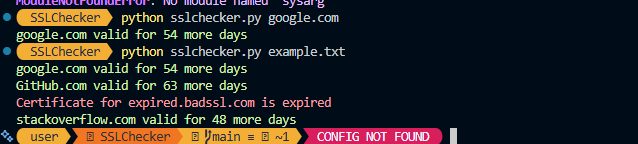

# SSLChecker
I made this to as i wanted to have my own terminal version of a SSL Checker. pwetty cool dude 

Features
- Check SSL certificates for a single domain
- Scan multiple domains at once
- Load domains from a .txt file
- Simple terminal interface

## Installation
```
git clone https://github.com/Radr443/SSLChecker.git
cd ssl-checker
pip install -r requirements.txt
```
Usage
Single Domain
`python sslchecker.py google.com`

Multiple domains (comma-separated)
`python sslchecker.py google.com,github.com,foobar.com`

Reading from a text file
`python sslchecker.py example.txt`



*I do plan on adding to this so it accepts CLI Arguments*

